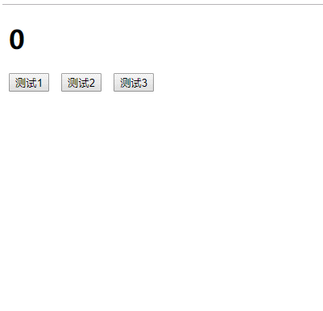
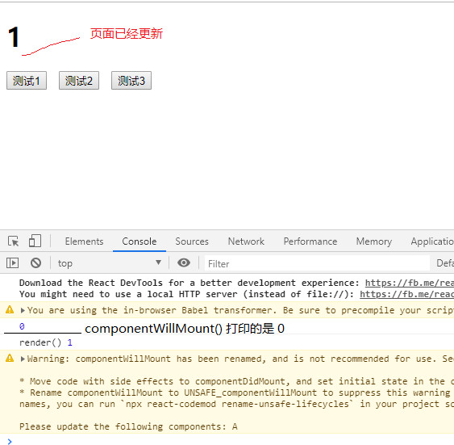
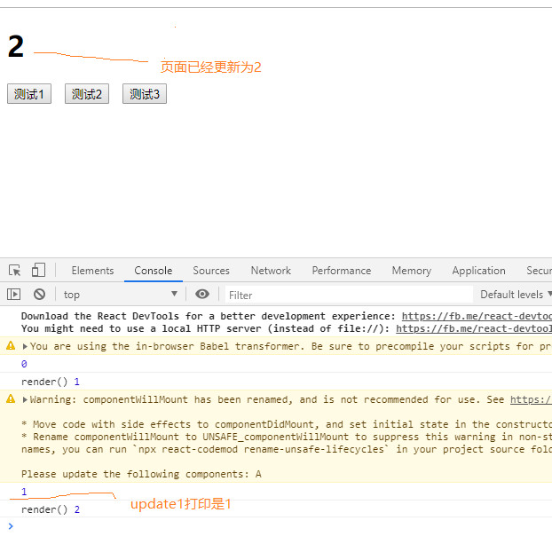
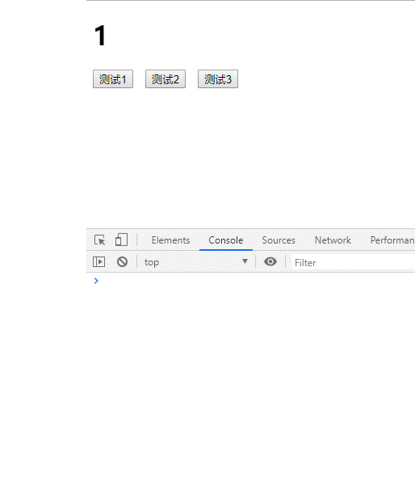
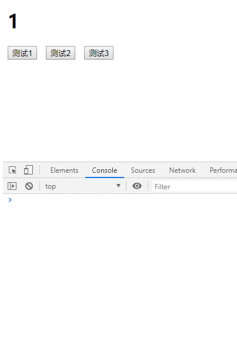
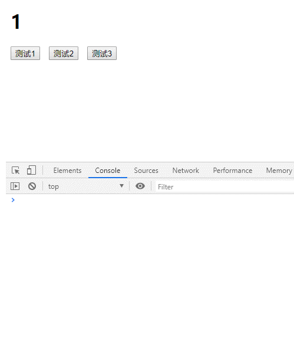

# React 中 setState()详细解读

对于 setState() 相信伙伴们都用过，它是 React 官方推荐用来更新组件 state 的 API，但是对于 setState() 你真的了解吗？且待我慢慢详聊一番。

## setState() 官方用法指南

语法1： `setState(updater[, callback])`

* updater：函数类型，返回一个更新后的 state 中的状态对象，它会和 state 进行浅合并。

* callback： 可选，回调函数。

语法2： `setState(stateChange[, callback])`

* setState: 对象类型，会将传入的对象浅层合并到新的 state 中。

* callback：可选，回调函数。

对于这两种形式，不同的是第一个参数选择问题，可以选择一个函数返回一个新的state对象，亦可以直接选择一个对象应用于状态更新，那么啥时候选择函数类型的参数，什么时候选择对象类型的呢？这里可以总结两句话：

* 当前状态更新无需依赖之前的state状态时，选择对象类型参数

* 当前更新状态依赖之前的状态时，选择函数类型参数

example： 

```html
<!DOCTYPE html>
<html lang="en">
<head>
  <meta charset="UTF-8">
  <meta name="viewport" content="width=device-width, initial-scale=1.0">
  <meta http-equiv="X-UA-Compatible" content="ie=edge">
  <title>setState详解</title>
  <script src="https://unpkg.com/react@16/umd/react.development.js"></script>
  <script src="https://unpkg.com/react-dom@16/umd/react-dom.development.js"></script>
  <script src="https://unpkg.com/babel-standalone@6.15.0/babel.min.js"></script>
</head>
<body>
  <div id="app"></div>
  <script type="text/babel">
    class A extends React.Component {
      state = {
        count: 0
      }
      update1 = () => {
        this.setState({count: this.state.count+1})
      }

      update2 = () => {
        this.setState(state => ({
          count: state.count+1
        }))
      }

      update3 = () => {
        this.setState({
          count: 8
        })
      }  

      render () {
        return (
          <div>
            <h1>{this.state.count}</h1>
            <button onClick={this.update1} style={{marginRight: 15}}>测试1</button><button style={{marginRight: 15}} onClick={this.update2}>测试2</button><button onClick={this.update3}>测试3</button>
          </div>         
        )
      }
    }
    ReactDOM.render(
    <A/>,
    document.getElementById('app')
    )
  </script>
</body>
</html>
```



这个例子中，我们通过点击按钮测试1或测试2来改变组件 A 的 count 状态值，因为每次修改状态都是在原先基础上加 1， 所以在setState 中适合选择函数类型参数，即 update2 写法推荐。

点击 测试3 按钮会直接将count 值修改为 固定值 8，这无需依赖上一次count状态值，所以在setState 中适合选择对象类型参数，即 update3 写法推荐。

## setState() 更新状态一定是异步的吗？

我们知道setState() 会触发组件render() 函数，重新渲染组件将更新后的内容显示在视图上，那么在 setState() 之后我们立马就能获取到最新的state值吗？

这里涉及到一个 setState() 是异步更新还是同步更新的问题？


结论：

* 在React相关的回调函数中setState() 是异步更新

* 不在React 相关的回调中setState() 是同步更新

React 相关的回调包括：组件的生命周期钩子，React 组件事件监听回调。

React不相关的回调包括常见的：setTimeout(), Promise()等。

我们还是可以拿之前的按钮点击实例来测试。

example：

```html
<!DOCTYPE html>
<html lang="en">
<head>
  <meta charset="UTF-8">
  <meta name="viewport" content="width=device-width, initial-scale=1.0">
  <meta http-equiv="X-UA-Compatible" content="ie=edge">
  <title>setState详解</title>
  <script src="https://unpkg.com/react@16/umd/react.development.js"></script>
  <script src="https://unpkg.com/react-dom@16/umd/react-dom.development.js"></script>
  <script src="https://unpkg.com/babel-standalone@6.15.0/babel.min.js"></script>
</head>
<body>
  <div id="app"></div>
  <script type="text/babel">
    class A extends React.Component {
      state = {
        count: 0
      }
      update1 = () => {
        this.setState({count: this.state.count+1})
        console.log(this.state.count)
      }

      update2 = () => {
        setTimeout(() => {
          this.setState(state => ({
            count: state.count+1
          }))
          console.log(this.state.count)
        })
      }

      update3 = () => {
        Promise.resolve().then(value => {
          this.setState({
            count: 8
          })
          console.log(this.state.count)
        })
      }

      componentWillMount () {
        this.setState(state => ({
          count: state.count+1
        }))
        console.log(this.state.count)
      }

      render () {
        console.log('render()', this.state.count)
        return (
          <div>
          <h1>{this.state.count}</h1>
            <button onClick={this.update1} style={{marginRight: 15}}>测试1</button><button style={{marginRight: 15}} onClick={this.update2}>测试2</button><button onClick={this.update3}>测试3</button>
          </div>         
        )
      }
    }
    ReactDOM.render(
    <A/>,
    document.getElementById('app')
  )
  </script>
</body>
</html>
```

我们在 React 事件监听回调 update1 和 组件生命周期 componentWillMount() 钩子里面分别在setState()之后打印最新的 state 值，发现打印出来的还是修改之前的state，但是页面已经更新为最新状态，看图：





采用同样的方法我们可以观察在 update2 的setTimeout() 和 update3 的 Promise() 回调中，setState() 后打印的是最新的state值，而且这个打印会在setState() 触发组件重新render() 之后。经过测试，恰好验证了我们的结论是正确的，在React 相关的回调中setState()是异步更新状态，在不相关的回调中 setState() 是同步更新状态。

## setState() 异步更新状态时，如何获取最新的状态值？

这个问题其实是针对当setState() 异步更新状态之后，怎么立马获取到最新的状态值，也就是上面例子我们说的在update1() 和componentWillMount()中怎么打印出最新的state值。


答案其实非常简单，也就是我们说到的setState()传参的第二个callback() 参数。setState() 的第二个回调会在更新状态之后，组件重新render() 之后调用，也就是这里面我们可以获取到最新的状态值。

代码：

```js

...

update1 = () => {
  this.setState({count: this.state.count+1}, () => {
    console.log(this.state.count)
  })
}

componentWillMount () {
  this.setState(state => ({
    count: state.count+1
  }), () => {
      console.log(this.state.count)
  })
}
```

这样，我们同样可以在update1 和 componentWillMount() 中 打印出最新的state值。

## 遇到重复多次调用setState()，React如何处理？

这里我们讨论的前提当然是setState() 异步更新状态时候，因为同步更新，我们调用几次 setState()，就会触发几次 render钩子，当然也会实时分别打印出更新后的状态值。

结论：

这里分两种情况讨论：

* 当setState() 传对象类型参数，React会合并重复多次的调用setState()，触发一次render。

* 当setState() 传函数类型参数，React会依次多次的调用setState()，触发一次render。

可以看到，我们多次重复调用setState()，不管是传参是何种类型。React都只会调用一次 render，重新渲染组件。

我们可以同样以按钮点击实例来测试我们结论。

example：

```html
<!DOCTYPE html>
<html lang="en">
<head>
  <meta charset="UTF-8">
  <meta name="viewport" content="width=device-width, initial-scale=1.0">
  <meta http-equiv="X-UA-Compatible" content="ie=edge">
  <title>setState详解</title>
  <script src="https://unpkg.com/react@16/umd/react.development.js"></script>
  <script src="https://unpkg.com/react-dom@16/umd/react-dom.development.js"></script>
  <script src="https://unpkg.com/babel-standalone@6.15.0/babel.min.js"></script>
</head>
<body>
  <div id="app"></div>
  <script type="text/babel">
    class A extends React.Component {
      state = {
        count: 0
      }
      update1 = () => {
        // this.setState({count: this.state.count+1}, () => {
        //   console.log(this.state.count)
        // })
        // this.setState({count: this.state.count+1}, () => {
        //   console.log(this.state.count)
        // })
        // this.setState({count: this.state.count+1}, () => {
        //   console.log(this.state.count)
        // })
        this.setState((state) => ({
          count: state.count+1
        }), () => {
          console.log(this.state.count)
        })
        this.setState((state) => ({
          count: state.count+1
        }), () => {
          console.log(this.state.count)
        })
        this.setState((state) => ({
          count: state.count+1
        }), () => {
          console.log(this.state.count)
        })
      }

      update2 = () => {
        setTimeout(() => {
          this.setState(state => ({
            count: state.count+1
          }))
          console.log(this.state.count)
          this.setState(state => ({
            count: state.count+1
          }))
          console.log(this.state.count)
          this.setState(state => ({
            count: state.count+1
          }))
          console.log(this.state.count)
        })
      }

      update3 = () => {
        Promise.resolve().then(value => {
          this.setState({
            count: 8
          })
          console.log(this.state.count)
        })
      }

      componentWillMount () {
        this.setState(state => ({
          count: state.count+1
        }))
        console.log(this.state.count)
      }

      render () {
        console.log('render()', this.state.count)
        return (
          <div>
          <h1>{this.state.count}</h1>
            <button onClick={this.update1} style={{marginRight: 15}}>测试1</button><button style={{marginRight: 15}} onClick={this.update2}>测试2</button><button onClick={this.update3}>测试3</button>
          </div>         
        )
      }
    }
    ReactDOM.render(
    <A/>,
    document.getElementById('app')
  )
  </script>
</body>
</html>
```

当点击测试按钮2，因为setState() 是同步更新状态，可以发现组件进行了多次render调用，分别依次打印出更新后的状态值，这个很简单。



我们点击测试按钮1，分别对传给setState()参数不同进行了测试，发现当传参是对象类型时候，React会合并重复setState()调用，也就是只更新一次state状态，传函数类型参数时候，则分别进行了计算更新。





无论以哪种方式传参重复调用 setState() ，React 都只会进行一次render 调用，这也是性能优化的一部分，防止多次重复渲染带来的性能问题。

其实官网推荐我们使用setState()时候，第一个参数传函数类型参数，因为函数参数中接收的 state 和 props 都保证为最新。
